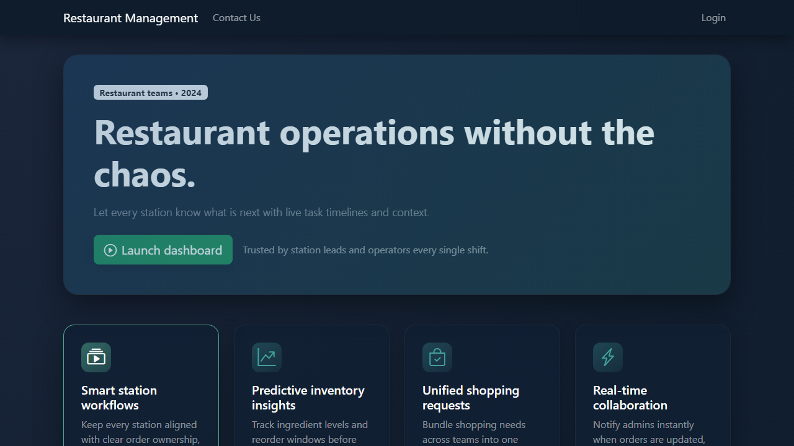
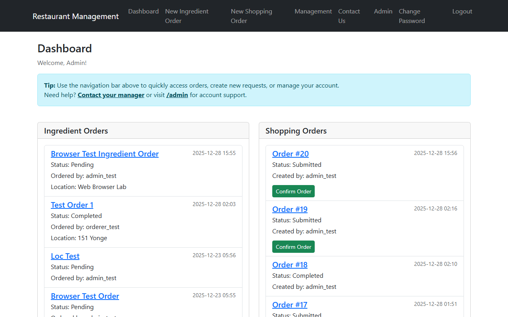

# Restaurant Order Manager

A comprehensive full-stack solution for managing restaurant operations, ingredients ordering, and station workflows. This application streamlines the communication between kitchen staff and management, ensuring inventory needs are tracked and fulfilled efficiently.

## Screenshots

### Welcome Page
The landing page provides a clean entry point for staff and management.


### Dashboard
The central hub for tracking ingredient requests and shopping orders.


---

## Features

-   **Role-Based Access Control**:
    -   **Admin**: Full access to the Management Dashboard, User management, Station configuration, and Ingredient database.
    -   **Staff**: Ability to create Ingredient Requests and view the main dashboard.
-   **Station-Centered Workflow**: Orders are organized by physical stations (e.g., Grill, Prep, Fridge), making it clear where supplies are needed.
-   **Multi-Location Support**: Manages operations across multiple restaurant branches (e.g., 180 Queen, 151 Yonge).
-   **Smart Order Processing**:
    -   **Ingredient Orders**: Staff request items needed for their station.
    -   **Shopping Orders**: Management aggregates requests into shopping lists for vendors.
-   **Status Tracking**: Real-time updates on order status (Pending, Processed, Submitted, Confirmed).

## How It Works

1.  **Staff Request (Ingredient Order)**:
    -   A cook or station lead notices they are low on stock.
    -   They log in and click "New Ingredient Order".
    -   They select their **Station** and **Location**, and add items (Ingredient + Quantity).
    -   The order appears on the Dashboard as "Pending".

2.  **Management Review**:
    -   A manager or chef reviews the "Ingredient Orders" panel on the Dashboard.
    -   They can mark orders as "Processed" once they are acknowledged.

3.  **Procurement (Shopping Order)**:
    -   To fulfill these needs, a manager creates a "New Shopping Order".
    -   They compile the necessary items, possibly grouping requests from multiple stations.
    -   This order tracks the external shopping process.

## Installation

### Prerequisites
-   Python 3.10+
-   pip
-   (Optional) PostgreSQL (The app supports SQLite for local development)

### Setup Steps

1.  **Clone the Repository**
    ```bash
    git clone <repository_url>
    cd <repository_name>
    ```

2.  **Create a Virtual Environment**
    ```bash
    python -m venv venv
    # Windows
    venv\Scripts\activate
    # macOS/Linux
    source venv/bin/activate
    ```

3.  **Install Dependencies**
    ```bash
    pip install -r requirements.txt
    ```

4.  **Environment Configuration**
    -   Copy `.env.example` to `.env`.
    -   For local development, ensure the following are set in `.env`:
        ```
        DEBUG=True
        USE_SQLITE_FALLBACK=True
        SECRET_KEY=your-insecure-dev-key
        ```

5.  **Database Migration**
    Apply the database schema:
    ```bash
    python manage.py migrate
    ```

6.  **Create Admin User**
    You can create a superuser to access the management features:
    ```bash
    python manage.py createsuperuser
    ```
    *Alternatively, use the helper script:*
    ```bash
    python create_test_user.py
    ```
    (Creates user `admin_test` with password `password123`)

7.  **Run the Server**
    ```bash
    python manage.py runserver
    ```

## Usage

1.  Open your browser and navigate to `http://127.0.0.1:8000/`.
2.  **Login**: Click "Login" at the top right.
    -   Use the credentials you created (e.g., `admin_test` / `password123`).
3.  **Dashboard**: You will be redirected to the Dashboard.
    -   **Create Order**: Use the sidebar or navigation links to create a new Ingredient Order.
    -   **Management**: If you are an admin, click "Management" in the navbar to access the admin-specific dashboard for user and station setup.

## Technical Stack

-   **Backend**: Django 5.0 (Python)
-   **Database**: SQLite (Dev) / PostgreSQL (Prod)
-   **Frontend**: Django Templates, Bootstrap 4 (via `crispy-bootstrap4`), Custom CSS
-   **Forms**: `django-crispy-forms`, `django-widget-tweaks`
