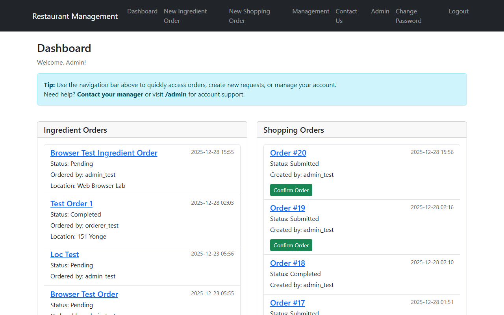
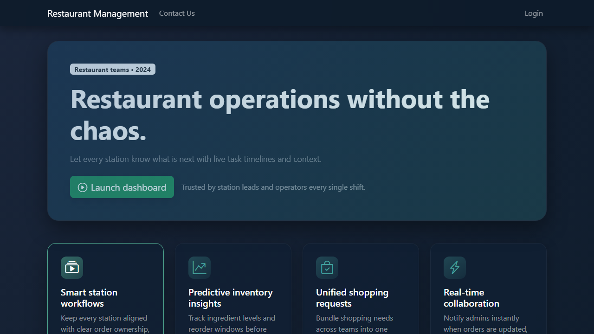

# 🍽️ Restaurant Order Manager

A Django web application for managing ingredient and shopping orders across multiple restaurant locations. Built for kitchen teams to coordinate stock requests, track order status, and reduce manual back-and-forth between stations and management.

**Live Demo:** [https://restaurant-order-manager-production.up.railway.app/](https://restaurant-order-manager-production.up.railway.app/)

> Demo credentials — Username: `admin_test` · Password: `password123`

---

## What It Does

- **Ingredient Orders** — Kitchen staff submit ingredient requests per station (Salad Bar, Sandwich Station, Hot Station, etc.). Orders move through Pending → In Progress → Completed.
- **Shopping Orders** — Authorized users create procurement shopping lists. Admins confirm and mark items as received with actual quantities.
- **Location-Based Access** — Users are tied to one of three restaurant locations. Location managers see only their site's orders; global admins see everything.
- **Management Console** — Admins manage users, stations, ingredient lists, and station-ingredient assignments.
- **Dashboard** — Real-time summary cards, Chart.js order-volume chart by location, and low-stock alerts.

---

## Tech Stack

| Layer | Technology |
|---|---|
| Backend | Python 3.12 · Django 5.1 |
| Database | PostgreSQL (production via Railway) · SQLite (local dev) |
| Frontend | Bootstrap 5.3 · Chart.js 4 · WhiteNoise static files |
| Auth | Django built-in auth + custom `CustomUser` model with role & location fields |
| Hosting | [Railway](https://railway.app) |
| Forms | django-crispy-forms · django-widget-tweaks |

---

## Screenshots

| Dashboard | Home Page |
|---|---|
|  |  |

> To add more screenshots: place `.png` files in `docs/screenshots/` and update this table.

---

## Local Setup

### Prerequisites

- Python 3.10+
- pip
- (Optional) PostgreSQL if you want to test with the production DB engine

### 1. Clone the repo

```bash
git clone https://github.com/radinMadadNezhad/Restaurant-Order-Manager.git
cd Restaurant-Order-Manager
```

### 2. Create a virtual environment

```bash
python -m venv venv
source venv/bin/activate      # Linux/macOS
venv\Scripts\activate         # Windows
```

### 3. Install dependencies

```bash
pip install -r requirements.txt
```

### 4. Set up environment variables

Copy the example file and edit it:

```bash
cp .env.example .env
```

Minimum required variables for local dev (see full list below):

```env
SECRET_KEY=your-local-secret-key
DEBUG=True
ALLOW_INSECURE_SECRET_KEY=true
USE_SQLITE_FALLBACK=true
```

### 5. Run migrations

```bash
python manage.py migrate
```

### 6. Create a superuser

```bash
python manage.py createsuperuser
```

### 7. Start the development server

```bash
python manage.py runserver
```

Visit [http://127.0.0.1:8000](http://127.0.0.1:8000)

---

## Environment Variables

| Variable | Required | Description |
|---|---|---|
| `SECRET_KEY` | ✅ Production | Django secret key |
| `DEBUG` | ✅ | `True` for local dev, `False` in production |
| `ALLOW_INSECURE_SECRET_KEY` | Dev only | Set `true` to skip SECRET_KEY check locally |
| `DATABASE_URL` | Production | Full PostgreSQL connection string (set by Railway) |
| `USE_SQLITE_FALLBACK` | Dev only | Set `true` to force SQLite |
| `RAILWAY_PUBLIC_DOMAIN` | Auto (Railway) | Injected by Railway, added to `ALLOWED_HOSTS` |
| `CSRF_TRUSTED_ORIGINS` | Optional | Comma-separated trusted origins for CSRF |
| `ADMIN_EMAIL` | Optional | Email to receive contact form notifications |
| `DEFAULT_FROM_EMAIL` | Optional | Sender address for outgoing emails |

---

## Project Structure

```
restaurant_management/    ← Django project settings, urls, wsgi
accounts/                 ← CustomUser model (role + location fields)
orders/                   ← Core app: models, views, forms, services, urls
templates/                ← All HTML templates
  base.html
  403.html / 404.html / 500.html
  orders/dashboard.html
  orders/...
  management/...
  registration/...
static/css/               ← Design system CSS + legacy styles
docs/screenshots/         ← App screenshots for README
```

---

## Roles & Locations

There are three restaurant locations:

- **180 Queen**
- **151 Yonge**
- **33 Yonge**

Each user is assigned one of these locations (or left blank for global admin access). Roles:

| Role | Can Do |
|---|---|
| **Admin** (global) | See all locations, manage users/stations/ingredients, confirm orders |
| **Staff** | Create and process orders at their location |
| **Orderer** | Submit ingredient orders for their location |

Superusers always see all locations regardless of the `location` field.

---

## Deployment (Railway)

The app is configured for Railway via `railway.json` and `Procfile.backup`. Railway injects `DATABASE_URL` and `RAILWAY_PUBLIC_DOMAIN` automatically.

Key production settings already in place:

- `DEBUG=False` (controlled by `DEBUG` env var, defaults to `False`)
- `ALLOWED_HOSTS` includes `*.railway.app`
- WhiteNoise serves static files
- `SECURE_SSL_REDIRECT`, `SECURE_HSTS_SECONDS`, `SESSION_COOKIE_SECURE` all enabled in production

---

## Contributing

1. Fork the repo
2. Create a feature branch: `git checkout -b feat/my-feature`
3. Commit your changes with a clear message
4. Open a Pull Request

---

## License

MIT — see `LICENSE` if included, otherwise contact the repo owner.
